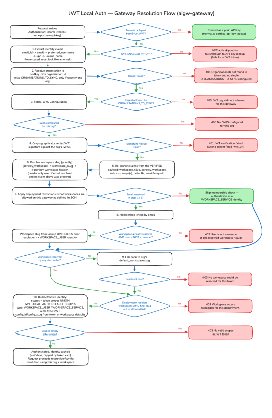

# JWT Local Auth — How the Gateway Resolves a Request

When a request arrives with a JWT bearer token instead of a Portkey API key, the gateway has
to work out, on its own, three things before it will serve the request:

1. **Which organisation** the token belongs to.
2. **Which workspace** inside that organisation the request should run against.
3. **What permissions (scopes)** the resulting identity should have.

This document walks through the logic the gateway uses to answer those three questions, in the
order it actually runs. It's written for operating and troubleshooting the gateway — not for
reading its source — so if you're chasing a `401`/`403` or an unexpected workspace, work
through this top to bottom against the token you're sending.

See [jwt-auth-flow.excalidraw](images/jwt-auth-flow.excalidraw) for a flowchart of the same
logic — open it at [excalidraw.com](https://excalidraw.com) (File → Open) or with the
Excalidraw VS Code extension. A rendered version is below:

## Terms used below

| Term | Meaning here |
|---|---|
| **Org (organisation)** | The top-level Portkey account/tenant a request runs under. |
| **Workspace** | A sub-division of an org that owns its own API keys, provider configs, and usage limits. Every request ultimately resolves to exactly one. |
| **Scope** | A permission string (e.g. `completions.write`) attached to the resulting identity, controlling what the request is allowed to do. |
| **Management plane** | Portkey's control API (`ALBUS_BASEPATH`) — the gateway calls it to look up org/workspace/deployment configuration, separate from serving the actual AI request. |
| **JWKS** | The JSON Web Key Set the token's signature is verified against — either a URL the gateway fetches, or an inline JSON blob, configured per-org on the management plane. |
| **SCM** | Portkey's user/identity management service. The gateway queries it to check whether a given email is a member of a given workspace. |

## When this logic applies

The gateway looks for a bearer token in `x-portkey-api-key` first, then falls back to the
`Authorization: Bearer <token>` header. Whichever header it comes from, the gateway decides
whether it's a JWT purely by its **shape**: if it's a three-part, base64url-looking string
(`header.payload.signature`), it's treated as a JWT and goes through the logic below. Otherwise
it's looked up as a plain Portkey API key. This means a real API key and a JWT can both be sent
as `Authorization: Bearer ...` and still be routed correctly — the gateway is sniffing the
token format, not relying on the header name.

If `JWT_ENABLED` is not `"ON"`, none of this runs — the token is passed straight to normal
API-key lookup, where it will fail.

## Step-by-step resolution

1. **Read identity claims off the token (unverified).** The gateway looks for an email-shaped
   claim, checking in order: `email_id → email → preferred_username → upn → unique_name`. The
   first one that looks like `user@domain` (lowercased) is kept as the user's identity; anything
   else is discarded. If none look email-shaped, the gateway instead uses `sub` or `uid` as a
   raw (non-email) identifier for later steps.

2. **Resolve the organisation.** The org ID comes from the token's `portkey_oid` or
   `organisation_id` claim.
   - If neither claim is present, the gateway falls back to `ORGANISATIONS_TO_SYNC` — but only
     when that setting lists exactly **one** org. If it lists more than one and the token has no
     org claim, the request is rejected:
     `401 "Organisation ID not found in token (portkey_oid / organisation_id) and no single
     ORGANISATIONS_TO_SYNC configured"`.
   - If an org ID *is* found on the token, it must still appear in the `ORGANISATIONS_TO_SYNC`
     allowlist. A token for an org this gateway isn't configured to serve is rejected:
     `403 "JWT org <id> not allowed for this gateway"`.

3. **Look up how to verify the token.** The gateway asks the management plane for that org's
   signing key material — either a JWKS URL or an inline JWKS document. If the org has neither
   configured, the request is rejected: `403 "No JWKS configured for this org"`.

4. **Verify the token's signature.** This is the first point at which the token is
   cryptographically checked — everything above only read claims off an *unverified* token.
   Verification is against the JWKS from step 3. A token signed by the wrong tenant, or a JWKS
   pointing at the wrong tenant, fails here with `401 "JWT verification failed: ..."`.

5. **Re-read claims from the verified token.** Now that the signature is trusted, the gateway
   re-extracts the fields it needs: `workspace_slug`, `portkey_workspace`, `sub`, `exp`,
   `scope`/`scopes`, `usage_limits`, `rate_limits`, `defaults`, and the email claim from step 1
   (this time from the verified payload, not the raw one).

6. **Resolve the workspace, first pass.** The gateway tries these in order and stops at the
   first match:
   1. the `portkey_workspace` claim,
   2. the `workspace_slug` claim,
   3. the `x-portkey-workspace` request header — **only** if the token resolved an email in
      step 1 *and* neither claim above was present. A workspace claim on the token always wins
      over this header.

   If none of these match, the workspace is still unresolved at this point and gets decided
   later (steps 7–9).

7. **Apply this deployment's restrictions.** The gateway fetches its own deployment
   registration from the management plane and, where configured, enforces:
   - `jwt_subs_allowed` — an allowlist of acceptable `sub` claims. A token whose `sub` isn't on
     the list is rejected with `403`.
   - `jwt_sub_workspace_mapping` — maps specific `sub` values to a workspace slug. This only
     applies if step 6 didn't already resolve a workspace.
   - If the deployment does **not** allow all workspaces, it must declare an explicit
     `workspaces` list. If no workspace has been resolved yet, the *first* entry in that list
     becomes the default.

8. **Check workspace membership by email.** If step 1/5 resolved an email address, the gateway
   asks SCM whether that person is a member of a workspace:
   - If a workspace was already resolved (from a claim, the header, or the deployment mapping
     above) and this person is **not** a member of it, the request is rejected:
     `403 "User is not a member of the resolved workspace <slug>"`.
   - Otherwise, the workspace SCM returns **overrides** anything resolved so far. In practice:
     for a token that carries an email but no explicit `portkey_workspace` claim, it's the
     person's actual workspace membership — not the `x-portkey-workspace` header or a deployment
     default — that decides the final workspace.
   - If no email was resolved at all, this membership check is skipped entirely, and the request
     will be authenticated as a **service identity** rather than a **user identity** (see
     step 10).

9. **Final fallback.** If no workspace has been resolved by any of the above, the gateway falls
   back to the org's own default workspace. If that still doesn't resolve to a real workspace,
   the request is rejected: `403 "No workspace could be resolved for this token"`. If the
   deployment restricts workspaces (step 7) and the final workspace isn't on that allowed list,
   the request is rejected: `403 "Workspace access forbidden for this deployment"`.

10. **Build the final identity.** The identity's scopes are the **union** of the token's own
    `scope`/`scopes` claim and this deployment's `JWT_LOCAL_AUTH_DEFAULT_SCOPES` — the deployment
    default doesn't replace the token's scopes, it's added to them. If the result is still empty,
    the request is rejected: `403 "No valid scopes in JWT token"`. The identity is typed
    **user** (an email was resolved and matched to a workspace member) or **service** (no email
    was resolvable), and its provider/model config comes from the token's `defaults` claim, or
    failing that, the workspace's own default config. This identity is then cached for up to
    7 days (capped by the token's own `exp`), so subsequent requests with the same token skip
    straight past steps 3–10.

## Troubleshooting by symptom

- **`401 Organisation ID not found...`** — the token has no `portkey_oid`/`organisation_id`
  claim, and `ORGANISATIONS_TO_SYNC` lists more than one org. Add an org claim via your identity
  provider's claims mapping, or narrow `ORGANISATIONS_TO_SYNC` to a single org if this gateway is
  only ever meant to serve one.

- **`403 JWT org <id> not allowed for this gateway`** — the token's org doesn't match this
  gateway's `ORGANISATIONS_TO_SYNC`. Confirm you're pointing at the right gateway instance, or
  update the allowlist.

- **`401 JWT verification failed`** — the signature check (step 4) failed. This usually means a
  tenant mismatch: the token was issued by a different EntraID tenant than the one whose JWKS is
  configured for this org. Compare the token's `tid`/`iss` claims against
  `airs aigateway organisations auth-settings get --tsg-id <tsg>`. Because claims are only read
  (not verified) in steps 1–3, a wrong-tenant token can get all the way to step 4 before this
  surfaces.

- **`403 User is not a member of the resolved workspace <slug>`** — a workspace was resolved (by
  claim, header, or deployment default) that the token's user isn't a SCM member of. Either add
  them to that workspace, or remove whatever is forcing that workspace so their real membership
  (step 8) can decide it instead.

- **`403 No workspace could be resolved for this token`** / **`403 Workspace access forbidden
  for this deployment`** — nothing in steps 6–9 produced a usable workspace, or it produced one
  outside this deployment's allowed list. Check the org's default workspace and this
  deployment's `workspaces` configuration.

- **`403 No valid scopes in JWT token`** — the union of the token's `scope`/`scopes` claim and
  `JWT_LOCAL_AUTH_DEFAULT_SCOPES` was empty. Check both sides — a typo'd scope claim and an
  empty/missing default scopes setting can each cause this alone.

- **Auth succeeds but a downstream error like `Following keys are not valid: vertex` appears** —
  JWT resolution (steps 1–10) worked. The identity just landed in a workspace/org that doesn't
  have that provider bound. Fix the provider config for the resolved workspace, not the JWT
  setup.

## Things that look configurable but aren't

- **`email_id` (or `email`/`upn`/`preferred_username`) is the load-bearing claim for
  per-user workspace resolution.** The gateway looks that email up via SCM (`/v2/users/details`)
  and, once no explicit `portkey_workspace` claim is present, that membership wins over
  everything else. This matches the claims-mapping guidance in
  `docs/aigw-entraid-claude-jwt-auth.md`.

- **`JWT_LOCAL_AUTH_DEFAULT_WORKSPACE` and `JWT_LOCAL_AUTH_WORKSPACE_ALLOWLIST`**, both set in
  [docker-compose.yml](../docker-compose.yml), are **not used by this gateway build** — they
  were checked directly against the bundled source and don't appear anywhere; only
  `JWT_LOCAL_AUTH_DEFAULT_SCOPES` is actually read. Don't rely on either to pin a workspace on
  this image version. To force a fixed workspace instead, use `x-portkey-workspace` (only takes
  effect when the token has no `portkey_workspace`/`workspace_slug` claim of its own, and does
  resolve an email), or set the workspace via the identity provider's Claims Mapping Policy
  (`portkey_workspace`) as described in `docs/aigw-entraid-claude-jwt-auth.md`.

- **A token with no email-shaped claim at all** (e.g. a bare `az account get-access-token` ARM
  token) can still authenticate — as a **service identity** — as long as it resolves an org
  (step 2) and a workspace (steps 6/7/9). It never goes through the membership check in step 8,
  so `x-portkey-workspace` and the deployment's defaults are what decide its workspace, not
  email membership.
